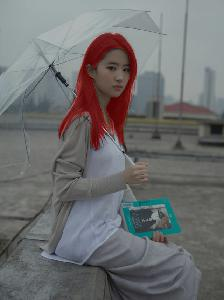
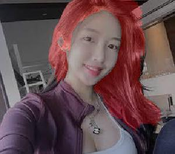

# HairSegmentation

##### 模型

- [x] UNet
- [x] DenseUNet

##### 数据集

CelebA, CelebAMask-HQ, Figaro为开源数据集

- [x] [CelebA]( http://www.cs.ubbcluj.ro/~dadi/face-hair-segm-database.html)
- [x] [CelebAMask-HQ](https://github.com/switchablenorms/CelebAMask-HQ)
- [x] [Figaro]( http://www.eecs.qmul.ac.uk/~urm30/Figaro.html)
- [x] Our
- [x] SpringFace
- [x] SpringHair

##### 参考

- https://github.com/ItchyHiker/Hair_Segmentation_Keras
- https://github.com/TropComplique/FaceBoxes-tensorflow

## 环境

```
- pytorch 1.0.1
- cudatoolkit 8.0
- opencv 3.1.0
- pillow 6.0
- tensorboardx 1.8
- tensorflow 1.13.1
- torchvision 0.2.2
- dlib 19.17  (可选)
```

## 训练

```
python scripts/main.py --model=unet train --dataset=CelebAMaskHQ --num-epochs=100 --batch-size=4 --lr=0.01 --iters-eval=10000 --save-path=model/unet.pth
```

##### 保持比例resize数据集中的图片, --resize的参数为resize后的短边长

```
python scripts/main.py --model=unet train --dataset=CelebA --resize=200 --num-epochs=100 --batch-size=32 --lr=0.01 --iters-eval=10000 --save-path=model/unet.pth
```

##### 随机裁剪: --crop-size=height **x** width

*Figaro中图片大小不一致，所以需要crop成一样的size*

```
python scripts/main.py --model=unet train --dataset=Figaro --resize=200 --crop-size=200x150 --num-epochs=100 --batch-size=32 --lr=0.01 --iters-eval=10000 --save-path=model/unet.pth
```

##### 数据增强: --argument

*ColorJitter, RandomHorizontalFlip, RandomRotate*

```
python scripts/main.py --model=unet train --dataset=Figaro --resize=200 --crop-size=200x150 --argument  --num-epochs=100 --batch-size=32 --lr=0.01 --iters-eval=10000 --save-path=model/unet.pth
```

##### 如果要使用 gpu： --gpu

```
python scripts/main.py --gpu=0 --model=unet train --dataset=Figaro --resize=200 --crop-size=200x150 --train-val-rate=0.8 --argument --num-epochs=100 --batch-size=32 --lr=0.01 --iters-eval=10000 --save-path=model/unet.pth
```

##### 指定多个gpu

```
python scripts/main.py --gpu 0 1 --model=unet train --dataset=Figaro --resize=200 --crop-size=200x150 --train-val-rate=0.8 --argument --num-epochs=100 --batch-size=32 --lr=0.01 --iters-eval=10000 --save-path=model/unet.pth
```

##### 载入预训练模型: --load-path

```
python scripts/main.py --gpu 0 --model=unet --load-path=model/unet.pth train --dataset=Figaro --resize=200 --crop-size=200x150 --train-val-rate=0.8 --argument --num-epochs=100 --batch-size=32 --lr=0.01 --iters-eval=10000 --save-path=model/unet.pth
```

## 测试

```
python scripts/main.py --gpu 0 1 --model=denseunet --load-path=model/denseunet.pth test --image=test.jpg --save=result.jpg
```

##### 保持比例resize: --resize (参数为短边长)

```
python scripts/main.py --gpu 0 1 --model=denseunet --load-path=model/denseunet.pth test --image=test.jpg --resize=300 --save=result.jpg
```

##### 去除结果中的小区域噪点: --remove-small-area

```
python scripts/main.py --gpu 0 1 --model=denseunet --load-path=model/denseunet.pth test --image=test.jpg --resize=300 --save=result.jpg --remove-small-area
```

##### 先做人脸检测再做分割: --detector

目前分别实现了faceboxes和dlib两种检测方式，faceboxes效果更好

faceboxes 来自于[FaceBoxes-tensorflow](https://github.com/TropComplique/FaceBoxes-tensorflow), 需要[下载](https://drive.google.com/drive/folders/1DYdxvMXm6n6BsOy4dOTbN9h43F0CoUoK)训练好的模型

dlib需要安装 `conda install -c menpo dlib`

```
python scripts/main.py --gpu 0 1 --model=denseunet --load-path=model/denseunet.pth test --image=test.jpg --resize=300 --save=result.jpg --remove-small-area --detector=faceboxes
```

##### 测试视频

```
python scripts/main.py --gpu 0 1 --model=denseunet --load-path=model/denseunet.pth test --video=test.avi --resize=300 --save=result.avi --remove-small-area --detector=faceboxes
```

##### 测试摄像头

按q退出

```
python scripts/main.py --gpu 0 1 --model=denseunet --load-path=model/denseunet.pth test --video=0 --resize=300 --save=result.avi --remove-small-area --detector=faceboxes
```

## 结果

!!